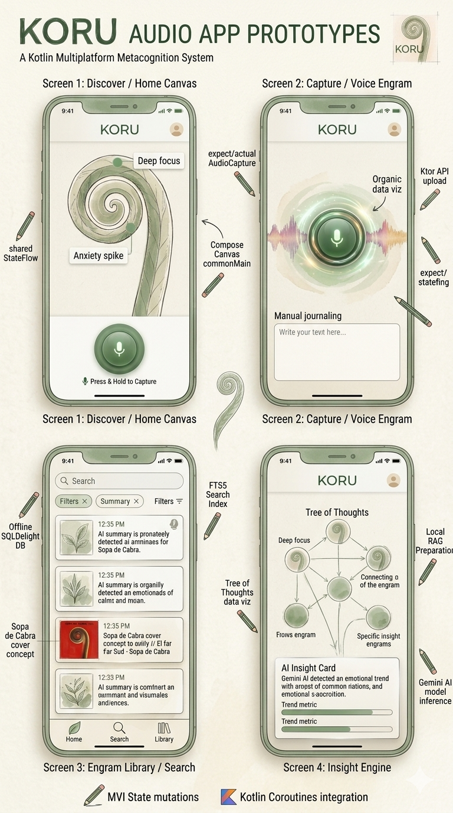

# 🌿 Koru: Your Personal Metacognition System

**A second brain for your inner world, built entirely with Kotlin Multiplatform.**

[](http://kotlinlang.org)
[](https://www.jetbrains.com/lp/compose-multiplatform/)
[](https://developer.android.com/studio/releases/gradle-plugin)
[](https://opensource.org/licenses/MIT)

## 🧠 What is Koru? (The Application Context)
Unlike standard journaling apps, **Koru** captures *how you react to the world* and uses AI to detect your thought patterns over time. Built on the **90/10 Principle** (10% is the event, 90% is the meaning we give it), Koru creates a luminous "Tree of Thoughts" rendered via a high-performance **Decoupled Canvas**. Every node is a recorded moment, and every branch represents a cognitive pattern.

> **KMP Contest Starter Kit 2026 Submission**
> This repository serves as a robust Starter Kit for the KMP Contest. It demonstrates an Offline-First architecture, custom Canvas UI, native platform APIs, and AI integrations.

---
## 📸 Interface Preview & Tactical Analysis

> **🤖 AI-Generated Reference:** *The UI prototypes shown below are high-fidelity mockups generated by AI. They serve as visual references to illustrate Koru's design system, architectural flow, and technical capabilities without needing to compile the project.*

This panel demonstrates the maturity of the Starter Kit. Each screen visually responds to a mandatory technical requirement of the KMP Contest:

*   **Discover / Home Canvas (MVI State & Canvas):** A refined version of the main screen, showcasing the decoupled data tree and the "Deep focus" visualization. Technical pencil annotations explain the architecture: *"shared MVI StateFlow"* and *"Compose Canvas integration in commonMain"*.
*   **Trace Capture / Audio Engram (Networking & Hardware):** This screen focuses on the recording flow. It features a prominent "Breathing Circle" FAB and organic audio data waves watermarked on the background. A technical annotation explains: *"expect/actual AudioCapture"* and *"Ktor API upload"*.
*   **Engram Library / Search (Local Persistence & FTS5):** A clean list of data cards, integrating a vintage aesthetic (inspired by classic album art) as the data visualization of an old "engram". A technical annotation indicates: *"Offline SQLDelight DB"* and *"FTS5 Search Index"*.
*   **Insight Engine (AI Analysis & Patterns):** The advanced analysis screen. The "Tree of Thoughts" maps emotional patterns detected by the Gemini AI. It displays an "AI Insight Card" and emotional trend metric bars. A technical annotation explains: *"Local RAG Preparation"* and *"Gemini AI model inference"*.



## 🎥 Video Demo (Pending) 
Watch the 3-minute technical walkthrough and concept demonstration here:
[](link-to-your-video)

---

## 🎯 Fulfilling the Starter Kit Grant Requirements
This codebase was meticulously designed to serve as an ultimate starting point for developers entering the KMP ecosystem. It implements all critical production features requested by the Kotlin Foundation:

### 1. Multiplatform Support
* **Fully Supported:** Android & iOS native compilation.
* **Shared UI:** 100% of the visual layer is built using Compose Multiplatform.

### 2. Networking & Remote Data
* **Ktor Client:** Handles asynchronous multiplatform HTTP/REST operations.
* **AI Service Integration:** Native integration with the Google Gemini API to analyze voice/text traces and extract emotional insights.

### 3. Local Data Persistence (Offline-First)
* **SQLDelight 2.x:** Type-safe database acting as the single source of truth.
* **FTS5 Integration:** Full-Text Search virtual tables native to both Android (SQLite) and iOS (CoreData/SQLite) for ultra-fast local Retrieval-Augmented Generation (RAG) capabilities.

### 4. Hardware Permissions & Native APIs
* **`expect/actual` Implementations:** Seamless abstraction for platform-specific hardware.
* **Audio Permissions & Capture:** Native `AudioRecord` (Android) and `AVAudioRecorder` (iOS) via shared multiplatform interfaces.
* **PDF Export:** Triggering `PdfDocument` (Android) and `UIGraphics` (iOS) directly from common code.

### 5. Notifications
* Local notification scheduling to support "Habit Stacking" and re-engagement, handled via platform-specific actualizations.

### 6. Testing & CI
* **Turbine Integration:** Deterministic testing of Kotlin `SharedFlow` and `StateFlow` asynchronous streams.
* **Architecture Mocks:** Repository fakes (`FakeTraceRepository`) to validate business logic without external dependencies.
* **GitHub Actions:** Pre-configured CI pipeline validating Android and iOS builds natively.

### 7. Modern Build System
* **AGP 9 Compliance:** Configured entirely with Android Gradle Plugin version 9 and version catalogs.

### 8. AI-Ready Codebase
* **`AGENTS.md` Protocol:** A specialized directive file in the root directory instructing AI coding agents (Cursor, Claude Code) on architectural boundaries, MVI patterns, and code generation rules.
* **`/SKILLS/` Directory:** Contextual prompts to support agent-driven build and test workflows.

## 🤖 AI-Ready & Spec-Driven Development (SDD)

This Starter Kit was not just "written" with AI; it was orchestrated using advanced agentic workflows. Built in alignment with the **Gentle-AI Stack** and **Engram** (persistent memory for AI agents), Koru demonstrates the future of software engineering: **Spec-Driven Development (SDD)**.

Instead of relying on fragmented chat windows, the development of Koru followed a strict pipeline:
1. **Spec First:** Every feature began as a PRD (Product Requirements Document) or technical specification. 
2. **Agentic Implementation:** Sub-agents implemented the code based strictly on these specs, preventing hallucinations and ensuring architectural consistency.
3. **Distilled Context:** Instead of sharing a noisy, raw AI chat history, the "brain" of this project has been distilled into a clean, modular format for future developers.

### How to use the AI capabilities in this repository:
To ensure this codebase is 100% **"AI-Ready"** for anyone (whether you use Claude Code, Cursor, Windsurf, or OpenCode), we have included:
* **`AGENTS.md`:** The root instruction file. Point your AI agent here first to understand the project's philosophy, boundaries, and commands.
* **`/SKILLS/` Directory:** A library of modular context files (e.g., `kmp-architecture.md`, `offline-first-sync.md`). If your agent needs to know how to implement a new Compose Canvas tree node or how our SQLDelight FTS5 sync works, instruct it to read the specific skill file first.

By treating context as code, Koru ensures that your AI assistant acts as a Senior Developer who already knows the codebase, rather than a Junior who needs constant correcting.

## 🛡️ Professional Engineering & Quality Assurance

To ensure this Starter Kit meets the highest industry standards, the development lifecycle incorporates enterprise-grade quality assurance, strict conventions, and AI-assisted review mechanisms:

*   **Gentleman Guardian Angel (GGA) & CI/CD:** We integrated GGA (an AI-powered code reviewer) directly into our Continuous Integration pipeline and pre-commit hooks. GGA automatically audits every commit and Pull Request against our architectural guidelines. It features an intelligent caching system that only analyzes modified files, optimizing token usage while strictly preventing regressions or architectural leaks.
*   **Test-Driven Development (TDD) & Turbine:** All core logic, especially the `TreeLayoutCalculator` and MVI state contracts, was built using a strict TDD loop. We utilize `Turbine` for robust, deterministic testing of asynchronous `StateFlow` and Coroutines, eliminating flaky tests and ensuring reliable state management.
*   **Strict Kotlin Conventions:** The codebase rigorously adheres to the official Kotlin Foundation Coding Conventions. This includes a strict preference for immutability (`val` and immutable collections everywhere), pure functions, mandatory KDoc documentation for all public APIs, and 4-space indentation enforced by automated `ktlint` checks.
*   **Git Best Practices:** We maintain a pristine Git history utilizing Conventional Commits (e.g., `feat:`, `fix:`, `refactor:`). This structured approach to branching and commit messaging makes the repository's evolution transparent and easy to navigate for new contest participants.

---

## 🚀 How to Run

### Prerequisites
* A machine running **macOS 14+** (Required for iOS compilation via Xcode).
* **Android Studio Ladybug** (or newer) / **IntelliJ IDEA**.
* **Xcode 15+** with command-line tools installed.
* **JDK 17**.
* **Gradle 8.7+** (managed via Gradle Wrapper).

### 🤖 Android Deployment
1. Open the project in Android Studio.
2. Select the `composeApp` configuration.
3. Run on an Emulator or Physical Device:
   ```bash
   ./gradlew :composeApp:installDebug

```
### 🍎 iOS Deployment
 1. Open a terminal and navigate to the iOS folder:
   ```bash
   cd iosApp
   
   ```
 2. Open iosApp.xcworkspace in Xcode.
 3. Select your Apple Developer Signing Team in the project settings.
 4. Run on an iPhone Simulator or connected physical device.
## 🧪 Judge's Walkthrough
To evaluate the technical depth of this project, we recommend the following flow:
 1. **Capture a Trace:** Tap the main Canvas node to record a voice or text engram. Observe the Ktor networking layer securely transmitting the context to the Gemini API.
 2. **Review the Insight:** See the UI reactively update via the unidirectional MVI flow as the AI returns emotional metadata.
 3. **Test Offline Capabilities:** Disable your internet connection. Search through your traces; observe the SQLDelight FTS5 engine querying records instantly without network access.
 4. **Export Data:** Navigate to settings and trigger a PDF export, validating the native expect/actual interop bridge.
## 📚 Educational Material & Blog Posts

As part of the Contest Starter Kit initiative, this repository is accompanied by a planned series of technical deep-dives to be published on the Kotlin Foundation Blog and LinkedIn:

1. **MVI & Canvas in Compose Multiplatform:** Rendering 120fps Trees without Recomposition.
2. **Building an Offline-First KMP App:** Seamless synchronization with SQLDelight and FTS5.
3. **Native Audio Interop:** Bridging iOS and Android hardware via `expect/actual` in commonMain.
## 📄 License
This project is open-sourced and distributed under the **MIT License**. 

We encourage KMP Contest participants to fork, study, and borrow from this Starter Kit to accelerate their own submissions.
```

